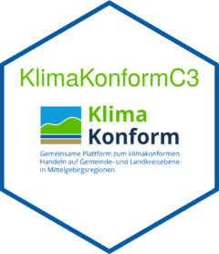

# KlimaKonformC3

<!-- badges: start -->

[](https://lifecycle.r-lib.org/articles/stages.html#stable)
[](http://www.gnu.org/licenses/gpl-3.0)
[](https://github.com/ahmathlete/KlimaKonformC3/actions/workflows/R-CMD-check.yaml)


<!-- badges: end -->


The goal of KlimaKonformC3 is to analyse the Agricultural Simulations
performed within of the Project KlimaKonform (TB C3 Landwirtschaft). The
project homepage is [here](https://klimakonform-dmp.geo.tu-dresden.de/).

## Installation

`KlimaKonformC3` is NOT available from CRAN, so you can NOT use
`install.packages("KlimaKonformC3")`.

You can install the development version of KlimaKonformC3 like so:

``` r
# Intsalling KlimaKonfromC3
devtools::install_github("ahmathlete/KlimaKonformC3")
```

## Infromation

### Functions

Many types of functions are included in the package:

1\. `sim` functions: they are mainly written to perform analysis on
    individual simulation files/file.

2\. `ens` functions: they are mainly written to perform analysis on
ensemble files/file.

3\. `clima` functions: they are mainly written to perform analysis of
climate projections used in agricultural simulations.


### Production

All R scripts used in production are included in `production` folder. 
``` r
library(KlimaKonformC3)
## basic example code
```

## Contact

Please file bug reports and feature requests at
<https://github.com/ahmathlete/KlimaKonformC3/issues>


## Disclaimer
The Original project logo is on the official project website mentioned above. The logo here is modified with @ColinFay's awesome [hexmake](https://connect.thinkr.fr/hexmake/) tool.
